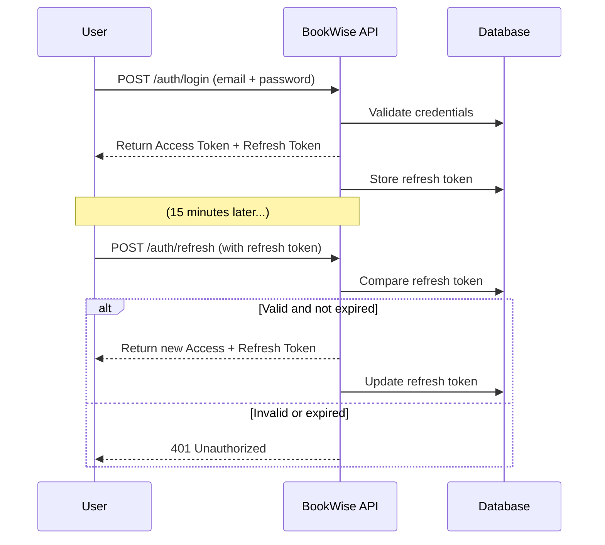
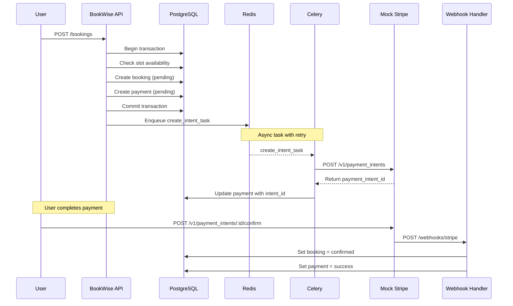

# 📘 BookWise: Merchant Booking Platform (FastAPI + PostgreSQL)

**BookWise is an online booking and payment system for real-world services.**

A production-grade backend system for managing merchant-based services (escape rooms, studios, barbershops, etc) — with robust booking, payment, review, and role management.

> ✅ Designed to scale: tested with 170K+ users and 1.6M+ simulated bookings  
> 🔧 Tech stack: FastAPI · PostgreSQL · Redis · Celery · Docker  
> 🚀 Deployed on Fly.io — [Live API](https://bookwise.fly.dev/docs#/)

---

## 🧭 Why I built BookWise

In Australia, I observed that many merchants — such as escape rooms, massage shops, and barbers — still rely on phone calls, Excel sheets, or WeChat to manage bookings. This manual workflow leads to issues like:

- ❌ Overbooked time slots  
- ❌ Miscommunication between staff  
- ❌ Missed or untracked payments

**BookWise** was created to solve that. It automates the full booking workflow:

- ✅ Merchants create services and available time slots  
- ✅ Users browse, book, pay, and review  
- ✅ Admins manage everything centrally

---

## 👥 Who uses BookWise?

### 🧑 Users
- Browse merchants and filter by categories (KTV, massage, escape rooms, etc.)
- View services (themes) and book open time slots
- Register and log in to book, pay, cancel, and review

### 🧑‍💼 Merchants
- Use their account to create/manage themes and time slots
- View all bookings and payments per slot
- Access stats like most booked themes or top customers

### 👑 Admins
- Manage all merchants, users, bookings, payments, reviews, and system data

---

### 🧑‍💻 Frontend Engineer Guide: User Stories

The following user stories describe how different roles interact with the system. Use these to plan page structure, UI flows, and component responsibilities.

---

#### 🧑 Users (Customers)

| Page / Flow | Description |
|-------------|-------------|
| **Home Page** | Users land on a homepage that lists all merchants, optionally filtered by category (e.g., KTV, massage, barbershop). |
| **Merchant Detail Page** | Clicking a merchant shows their available services (themes), such as different escape room types or massage packages. |
| **Theme Detail Page** | Clicking a theme shows available time slots with their remaining capacity, along with past user reviews. |
| **Slot Booking Page** | If a slot is not full, the user can book it. |
| **Mock Payment Page** | After booking, users are redirected to a Stripe-style mock payment page, where they enter card details and click “Pay” to confirm the payment. |
| **Review Page** | After successfully booking and paying, the user can write a review for the theme they experienced. |
| **My Bookings Page** | Users can view their past bookings and payment history, including whether each was successful. |
| **Authentication** | After logging in, users stay authenticated with token auto-refresh running every 15 minutes — the frontend should refresh tokens silently to keep users logged in. |

---

#### 🧑‍💼 Merchants

| Page / Flow | Description |
|-------------|-------------|
| **Merchant Dashboard** | Merchants can view and manage all of their services (themes). |
| **Slot Management Page** | For each theme, merchants can create, edit, or remove available time slots. |
| **Booking Overview** | For any slot, merchants can view the list of confirmed bookings (e.g., names, times). |

---

#### 👑 Admins

| Page / Flow | Description |
|-------------|-------------|
| **User Management Panel** | Admins can browse and inspect all user profiles. |
| **Global Theme/Slot Panel** | Admins can create or edit themes and slots for any merchant in the system. |
| **(Optional) Admin Dashboard** | In the future, admins may view analytics like booking volume, top customers, or review trends. |

---

## 🛠️ Core Services & API Overview

### 🔐 Auth Service  
Handles user registration, login, and refresh token flow using JWT.

| Endpoint          | Method | Purpose                                 | Role    |
|-------------------|--------|-----------------------------------------|---------|
| `/auth/register`  | POST   | Register a new user                     | Public  |
| `/auth/login`     | POST   | Login and receive access + refresh JWT  | Public  |
| `/auth/refresh`   | POST   | Refresh access token using refresh JWT  | Requires refresh token |

---

### 👤 User Service  
Fetch user info, personal bookings, and admin-only user lookups.

| Endpoint               | Method | Purpose                                        | Role        |
|------------------------|--------|------------------------------------------------|-------------|
| `/users/me`            | GET    | Get current logged-in user's profile          | User |
| `/users/me/bookings`   | GET    | Get current user's booking history            | User    |
| `/users/`              | GET    | Get list of all users                         | Admin only   |
| `/users/{user_id}`     | GET    | Get any user by ID                            | Admin only   |

---

### 🏪 Merchant Service  
Allows users to become merchants and view merchant directories.

| Endpoint              | Method | Purpose                                           | Role         |
|-----------------------|--------|---------------------------------------------------|--------------|
| `/merchants`          | GET    | List all merchants, with optional category filter | Public       |
| `/merchants`          | POST   | Create merchant profile (user becomes merchant)   | User         |

---

### 🎭 Theme Service  
Merchants can manage their services (themes), such as escape room types or massage offerings.

| Endpoint                          | Method | Purpose                                   | Role      |
|-----------------------------------|--------|-------------------------------------------|-----------|
| `/merchants/{merchant_id}/themes`          | GET    | Get all themes under a merchant           | Public    |
| `/merchants/{merchant_id}/themes`          | POST   | Create a new theme under a merchant  | Merchant / Admin |

---

### ⏱️ Slot Service  
Merchants create and manage time slots under each theme.

| Endpoint                               | Method | Purpose                                    | Role      |
|----------------------------------------|--------|--------------------------------------------|-----------|
| `/themes/{theme_id}/slots`                   | GET    | List all slots under a theme               | Public    |
| `/themes/{theme_id}/slots`                   | POST   | Create a new slot under a theme            | Merchant / Admin  |
| `/slots/{theme_id}/availability`             | GET    | Check slot availability (capacity status)  | Public    |

---

### 📅 Booking Service  
Users book available slots, merchants can view confirmed bookings.

| Endpoint                           | Method | Purpose                                              | Role       |
|------------------------------------|--------|------------------------------------------------------|------------|
| `/slots/{slot_id}/book`                 | POST   | User books a slot and triggers payment intent        | User     |
| `/slots/{slot_id}/bookings`            | GET    | Merchant views confirmed bookings under the slot     | Merchant / Admin  |
| `/slots/{slot_id}/booking-count`       | GET    | View number of confirmed bookings + slot capacity    | Public     |

---

### 💳 Payment Service  
Handles payment records linked to bookings. Typically queried after booking is created.

| Endpoint                             | Method | Purpose                                                              | Role    |
|--------------------------------------|--------|----------------------------------------------------------------------|---------|
| `/bookings/{booking_id}/payment`     | GET    | Get payment info for a booking (user must own booking)              | User    |

---

### ✍️ Review Service  
Users can review themes they’ve experienced. One review per user per theme.

| Endpoint                             | Method | Purpose                                                                 | Role    |
|--------------------------------------|--------|-------------------------------------------------------------------------|---------|
| `/themes/{theme_id}/review`          | POST   | Submit a review (must have completed + paid booking for that theme)    | User    |
| `/themes/{theme_id}/reviews`         | GET    | Get all reviews for a theme                                            | Public  |

---

### 📡 Stripe Webhook

This production endpoint receives payment confirmation from the mock Stripe API and finalizes the booking flow by updating both the booking and payment records.

| Endpoint               | Method | Purpose                                                                      | Role     |
|------------------------|--------|------------------------------------------------------------------------------|----------|
| `/webhooks/stripe`     | POST   | Confirm payment success and update booking status to `confirmed`             | Internal (Stripe-triggered) |

> ✅ This endpoint is deployed in **production** and plays a key role in completing the payment lifecycle.

---

### 🧪 Mock Stripe API (Production)

This mock Stripe service handles payment intent creation and confirmation in production, enabling a full end-to-end booking + payment flow without real Stripe credentials.

| Endpoint                                        | Method | Purpose                                                      | Role          |
|-------------------------------------------------|--------|--------------------------------------------------------------|---------------|
| `/v1/payment_intents`                           | POST   | Create a mock payment intent with idempotency support        | Internal      |
| `/v1/payment_intents/{intent_id}/confirm`       | POST   | Simulate payment confirmation and trigger BookWise webhook   | Internal      |

> 🔁 Supports Redis-based idempotency + webhook retry logic  
> 🧪 Designed for realistic production testing of the booking/payment lifecycle

---

## 🔄 System Flow Diagrams

### 🔐 Refresh Token Flow

> ⏳ Access tokens expire every 15 minutes  
> ♻️ Refresh tokens are valid for 30 days and rotated with every use  
> 🗃️ Expired refresh tokens remain in the database and are ignored on validation

---

### 💸 Booking Flow

> 🧱 Booking + Payment creation is wrapped in a DB transaction  
> ⏳ Intent generation is async (Redis → Celery → Stripe)  
> 📡 Final confirmation handled via webhook

---

## 🧠 Design Highlights

- 🔐 **Refresh token storage**: Refresh tokens are stored and validated in the database, allowing for secure session control and token invalidation.
- 🔁 **Token rotation**: Supports long-term login sessions by issuing new access and refresh tokens securely via the refresh flow.
- 🧾 **Stripe idempotency**: All payment-related operations are idempotent using a UUID-based `idempotency_key` to ensure safe retries and prevent duplicates.
- 🧱 **Atomic booking + payment creation**: Booking and initial payment records are created in a single database transaction to prevent inconsistent states.
- ⏳ **Async payment intent generation**: Stripe payment intent creation is deferred to an asynchronous Celery task, queued via Redis.
- ⚙️ **Background worker updates**: A Celery worker picks up delayed jobs and updates the `payment_intent_id` in the database asynchronously.
- 🌐 **End-to-end payment lifecycle**: The full flow—from booking to payment confirmation and webhook handling—is production-deployed and fully automated.
- 🧮 **Normalized SQL schema**: All entities follow a clean relational design with foreign keys, uniqueness constraints, and optimized query paths.
- 🚦 **Role-based route control**: Access is restricted by roles (`User`, `Merchant`, `Admin`) with fine-grained permission checks (e.g. merchants can only manage their own resources).

---

### 🛡️ Reliability & Error Handling

- ✅ **Atomic transactions**: Booking and payment records are created in a single DB transaction to avoid partial writes.
- ✅ **Race condition prevention**: Slot availability is checked + reserved within the same transaction to prevent double booking under concurrency.
- ✅ **Webhook idempotency**: Duplicate Stripe webhooks are handled safely by checking booking/payment status before updating.
- ✅ **Celery retry logic**: Async tasks automatically retry on failure (e.g., Stripe timeout) with backoff.
- ✅ **Exception handling**: All APIs use FastAPI’s custom exception handlers for structured JSON errors and logging.

---

## 📊 Database Schema

BookWise uses a **normalized relational schema** to ensure data consistency, performance, and extensibility. The key design principles include:

- ✅ **1-to-1 and 1-to-many relationships** (e.g. User ➝ Merchant, Theme ➝ Slot)
- 🎯 **Composite uniqueness constraints** to prevent double-booking and duplicate content
- 🔐 **Role inheritance via user-role-enforced logic** (e.g. only users can become merchants)
- 🔁 **Bidirectional foreign key bindings** to support reverse lookups and efficient JOINs

Key tables include:

- `users`: stores login credentials, roles, and refresh tokens  
- `merchants`: linked 1-to-1 with users, stores business profile and category  
- `themes`: merchant-owned services (e.g. escape room theme or haircut style)  
- `slots`: time slots under a theme, with start/end time and capacity  
- `bookings`: connects users and slots, with a status lifecycle  
- `payments`: one per booking; stores method, amount, status, and intent ID  
- `reviews`: each user can leave one review per theme per booking

📷 Below is a visual representation of the schema:

---

### 🔍 Schema Constraints

- 🔐 Composite uniqueness enforced on `(user_id, slot_id)` to prevent duplicate bookings
- 🧩 Slot `capacity` is enforced during booking transaction to avoid overbooking
- 🔁 All foreign key relationships use `ON DELETE CASCADE` where appropriate

---

## ✅ Next Features to Build

### 🔁 Booking Management & Refunds
- Cancel booking (user-initiated before slot starts)
- Simulate or handle refunds (update booking + payment status)
- Optional: async refund task via Celery

### 🗑️ Deletion & Cleanup
- Delete theme (only if no active slots/bookings)
- Delete slot (only if no confirmed bookings)
- Optional: implement soft delete (`is_deleted` flag)

### 🧪 Testing & DevOps

- ✅ **Unit + integration tests** for key flows (auth, booking, payment) using `pytest`
- ✅ **Simulated concurrency** testing with 1.6M booking operations
- ✅ **Dockerized** backend for reproducible dev and production environments
- ✅ **Deployed to Fly.io** with production config
- 🚀 *Optional: Add GitHub Actions CI/CD or deployment hooks for automatic rollout*

### 📊 Analytics & Reporting
**Merchant-side:**
- Top themes by bookings (last 7/30 days)
- Top customers by activity or payment
- Slot occupancy rates (utilization)

**Admin-side:**
- Revenue by merchant/category
- Review rating distribution
- Active users, repeat bookings, popular slots

### 💡 Future Enhancements
- Admin UI panel for data management
- AI-based recommendations (“Users also booked…”)
- Email confirmations/reminders
- Recurring slots (e.g. every Friday 7pm)
- Invoicing (generate downloadable PDFs)

---

### ✅ Why This Project Shows Senior-Level Backend Skills

- Designed for **real-world edge cases**: async jobs, payment reconciliation, user misbehavior
- Demonstrates mastery of **database modeling**, **task queues**, and **authentication**
- Built with **deployment, scaling, and maintainability** in mind
- Fully documented and ready for production extension

---

## 👥 Credits & Status

Created and maintained by Peter Wu.  
Currently backend-only — frontend collaboration welcome.
