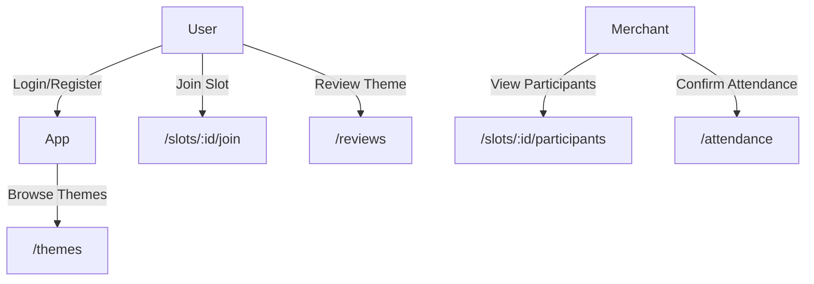

# 📘 BookWise: Merchant Booking Platform (FastAPI + PostgreSQL)

A production-grade backend system for managing merchant-based services (escape rooms, classes, etc) — with robust booking, payment, review, and role management.

> ✅ Designed to scale: tested with 170K+ users and 1.6M+ simulated bookings  
> 🔧 Tech stack: FastAPI · PostgreSQL · Redis · Celery · Stripe · Docker  
> 🚀 Deployed on Fly.io — [Live API](https://bookwise.fly.dev/docs#/)

---

## 🌟 Key Features

- 🧾 Booking flow: Merchant → Service (Theme) → Slot → Booking
- 🔐 Role-based access: Admin · Merchant · User
- 📅 Slot availability enforcement + overbooking prevention
- 💬 Review system: one-review-per-theme per user
- 💳 Stripe integration (idempotency + webhook)
- 🚦 JWT auth + refresh token
- 📦 Async background jobs via Celery (e.g. payment retry)
- 🧱 Modular clean architecture (Router ➝ Service ➝ CRUD ➝ Model)

---

## ⚙️ Tech Stack

| Category       | Tools                                      |
|----------------|---------------------------------------------|
| Web API        | FastAPI, Pydantic                          |
| DB Layer       | PostgreSQL, SQLAlchemy, Alembic            |
| Auth           | JWT (access/refresh), bcrypt               |
| Async / Jobs   | Celery, Redis                              |
| Payments       | Stripe (intent + webhook + idempotency)    |
| DevOps         | Docker, Fly.io                             |
| Dev Tools      | Postman                    |

---

## 🗂️ Database Design (ERD)

> 

**Key Entities:**
- `User` → may become `Merchant`
- `Merchant` → owns `Themes` (services like escape rooms)
- `Theme` → has multiple `Slots`
- `Slot` → can be booked → `Booking` / `Participant`
- `Review` → linked to `(User, Theme)` pair

---

## 🔄 Booking Flow Diagram

---

## 🔌 API Examples

| Endpoint                  | Method | Description             |
|---------------------------|--------|-------------------------|
| `/auth/register`          | POST   | User signup             |
| `/themes`                 | GET    | List all themes         |
| `/slots/:id/join`         | POST   | Book a slot             |
| `/slots/:id/participants` | GET    | List participants       |
| `/reviews`                | POST   | Submit theme review     |
| `/payments/create`        | POST   | Stripe intent           |

📎 [Postman Collection](#)  
📎 [cURL Examples](#)

---

## 🧠 Design Highlights

- Optimized SQL with index testing, JOIN patterns, and EXPLAIN ANALYZE
- Role-aware permission logic (admin vs merchant vs user routes)
- Strict data model: enforced FK constraints, 1–1 review per theme
- Modular codebase: fully separated concerns (router/service/crud)
- Async retry-safe payment handling via Celery

---

## 🚀 Deployment & Usage

- Deployed with Docker + Fly.io
- Uses Upstash Redis for async job backend
- Environment variables: `.env.example` included
- Live backend link: [https://bookwise.fly.dev](https://bookwise.fly.dev)

---

## 📸 Screenshots / Demo (optional)

> _[Insert screenshot or GIF of flow / schema visualizer / logs / etc]_

---

## 👥 Credits & Status

Created and maintained by Peter Wu.  
Currently backend-only — frontend collaboration welcome.
