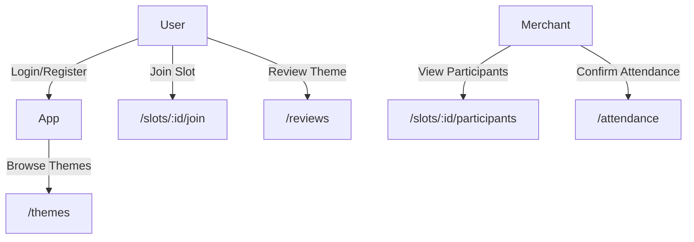

# 📘 BookWise: Merchant Booking Platform (FastAPI + PostgreSQL)

**BookWise is an online booking and payment system for real-world services.**

A production-grade backend system for managing merchant-based services (escape rooms, studios, barbershops, etc) — with robust booking, payment, review, and role management.

> ✅ Designed to scale: tested with 170K+ users and 1.6M+ simulated bookings  
> 🔧 Tech stack: FastAPI · PostgreSQL · Redis · Celery · Docker  
> 🚀 Deployed on Fly.io — [Live API](https://bookwise.fly.dev/docs#/)

---

## 🧭 Why I built BookWise

In Australia, I observed that many merchants — such as escape rooms, massage shops, and barbers — still rely on phone calls, Excel sheets, or WeChat to manage bookings. This manual workflow leads to issues like:

- ❌ Overbooked time slots  
- ❌ Miscommunication between staff  
- ❌ Missed or untracked payments

**BookWise** was created to solve that. It automates the full booking workflow:

- ✅ Merchants create services and available time slots  
- ✅ Users browse, book, pay, and review  
- ✅ Admins manage everything centrally

---

## 👥 Who uses BookWise?

### 🧑 Users
- Browse merchants and filter by categories (KTV, massage, escape rooms, etc.)
- View services (themes) and book open time slots
- Register and log in to book, pay, cancel, and review

### 🧑‍💼 Merchants
- Use their account to create/manage themes and time slots
- View all bookings and payments per slot
- Access stats like most booked themes or top customers

### 👑 Admins
- Manage all merchants, users, bookings, payments, reviews, and system data

---

## 🛠️ Core Services & API Overview

### 🔐 Auth Service  
Handles user registration, login, and refresh token flow using JWT.

| Endpoint          | Method | Purpose                                 | Role    |
|-------------------|--------|-----------------------------------------|---------|
| `/auth/register`  | POST   | Register a new user                     | Public  |
| `/auth/login`     | POST   | Login and receive access + refresh JWT | Public  |
| `/auth/refresh`   | POST   | Refresh access token using refresh JWT | Requires refresh token |

---

### 👤 User Service  
Fetch user info, personal bookings, and admin-only user lookups.

| Endpoint               | Method | Purpose                                        | Role        |
|------------------------|--------|------------------------------------------------|-------------|
| `/users/me`            | GET    | Get current logged-in user's profile          | User / Merchant / Admin |
| `/users/me/bookings`   | GET    | Get current user's booking history            | User / Merchant / Admin       |
| `/users/`              | GET    | Get list of all users                         | Admin only   |
| `/users/{user_id}`     | GET    | Get any user by ID                            | Admin only   |

---

## ⚙️ Tech Stack

| Category       | Tools                                      |
|----------------|---------------------------------------------|
| Web API        | FastAPI, Pydantic                          |
| DB Layer       | PostgreSQL, SQLAlchemy, Alembic            |
| Auth           | JWT (access/refresh), bcrypt               |
| Async / Jobs   | Celery, Redis                              |
| Payments       | Stripe (intent + webhook + idempotency)    |
| DevOps         | Docker, Fly.io                             |
| Dev Tools      | Postman                    |

---

## 🗂️ Database Design (ERD)

> 

**Key Entities:**
- `User` → may become `Merchant`
- `Merchant` → owns `Themes` (services like escape rooms)
- `Theme` → has multiple `Slots`
- `Slot` → can be booked → `Booking` / `Participant`
- `Review` → linked to `(User, Theme)` pair

---

## 🔄 Booking Flow Diagram

---

## 🔌 API Examples

| Endpoint                  | Method | Description             |
|---------------------------|--------|-------------------------|
| `/auth/register`          | POST   | User signup             |
| `/themes`                 | GET    | List all themes         |
| `/slots/:id/join`         | POST   | Book a slot             |
| `/slots/:id/participants` | GET    | List participants       |
| `/reviews`                | POST   | Submit theme review     |
| `/payments/create`        | POST   | Stripe intent           |

📎 [Postman Collection](#)  
📎 [cURL Examples](#)

---

## 🧠 Design Highlights

- Optimized SQL with index testing, JOIN patterns, and EXPLAIN ANALYZE
- Role-aware permission logic (admin vs merchant vs user routes)
- Strict data model: enforced FK constraints, 1–1 review per theme
- Modular codebase: fully separated concerns (router/service/crud)
- Async retry-safe payment handling via Celery

---

## 🚀 Deployment & Usage

- Deployed with Docker + Fly.io
- Uses Upstash Redis for async job backend
- Environment variables: `.env.example` included
- Live backend link: [https://bookwise.fly.dev](https://bookwise.fly.dev)

---

## 📸 Screenshots / Demo (optional)

> _[Insert screenshot or GIF of flow / schema visualizer / logs / etc]_

---

## 👥 Credits & Status

Created and maintained by Peter Wu.  
Currently backend-only — frontend collaboration welcome.
